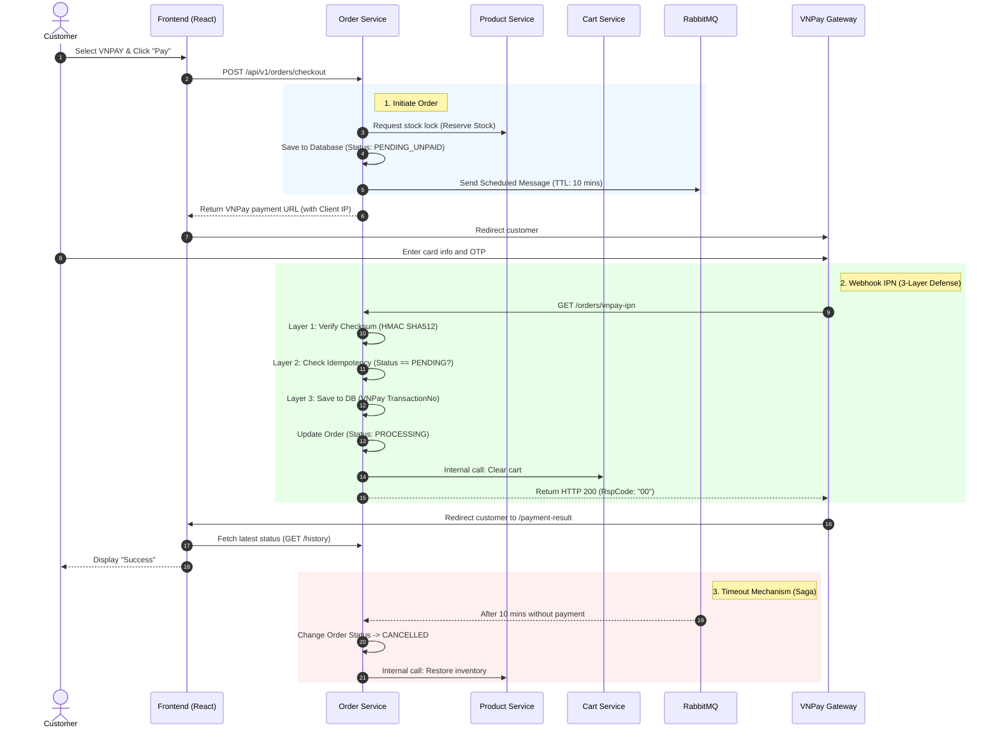

# VNPay Payment Flow

This document details the payment processing flow via the VNPay gateway within the Microservices architecture. The transaction flow is designed with **Production-ready security standards**, ensuring data safety, preventing signature forgery (Checksum), avoiding duplicate processing (Idempotency), and automatically handling overdue orders using RabbitMQ.

## 1. Sequence Diagram

### 2. Details

#### Initiate Order

* **Endpoint:** `POST /api/v1/orders/checkout`
* **Internal Processing:** * Call `Product Service` to lock the product quantity (Reserve Stock).
    * Order status: `PENDING_UNPAID`. The shopping cart (`Cart`) is **not yet cleared**.
    * Extract the real Client IP (bypassing proxy/gateway) to attach to the VNPay payload.
    * Publish an event to **RabbitMQ** with a Time-To-Live (TTL) of 10 minutes.

#### Redirect and Payment

* Backend returns `paymentUrl`, Frontend redirects the user to the VNPay payment gateway.
* VNPay handles issues related to card entry and OTP verification.

#### Webhook IPN

Public API for VNPay to call back and report the result (`GET /api/v1/orders/vnpay-ipn`).

1. **Layer 1 - Checksum Security:** * Collect 100% of the parameters returned by VNPay using a dynamic data structure (`Map<String, String>`).
    * Remove signature fields, sort alphabetically, concatenate the string, and hash it using the `HMAC SHA512` algorithm with the `Secret Key`.
    * Compare the result with `vnp_SecureHash`. Errors will be returned by the system with error code `97 - Invalid Checksum`.

2. **Layer 2 - Idempotency:**
    * Query the current order status. If the order is **no longer** in the `PENDING_UNPAID` status (meaning it was successfully processed previously, or cancelled), the system immediately ignores this IPN and returns error code `02 - Order already confirmed`. This prevents VNPay from spamming callbacks during network lag, ensuring safety for the inventory deduction flow.

3. **Layer 3 - Database Update:**
    * Use `vnp_TransactionNo` (Bank reference code) directly as the `TransactionCode` to save into the Database, serving reconciliation and refund operations.
    * Change the `orders` table status to `PROCESSING`.
    * Call `Cart Service` to clear the User's shopping cart.

#### Timeout via Message Broker

In case the customer closes the browser, cancels the payment, or the card has insufficient funds (Order is stuck at `PENDING_UNPAID`):

* After 10 minutes, the message in RabbitMQ expires and falls into the **Dead Letter Exchange (DLX)**.
* The system catches this message and automatically changes the order status to `CANCELLED`.
* Triggers the Compensation Transaction flow, calling `Product Service` to restore inventory (Increase Stock).