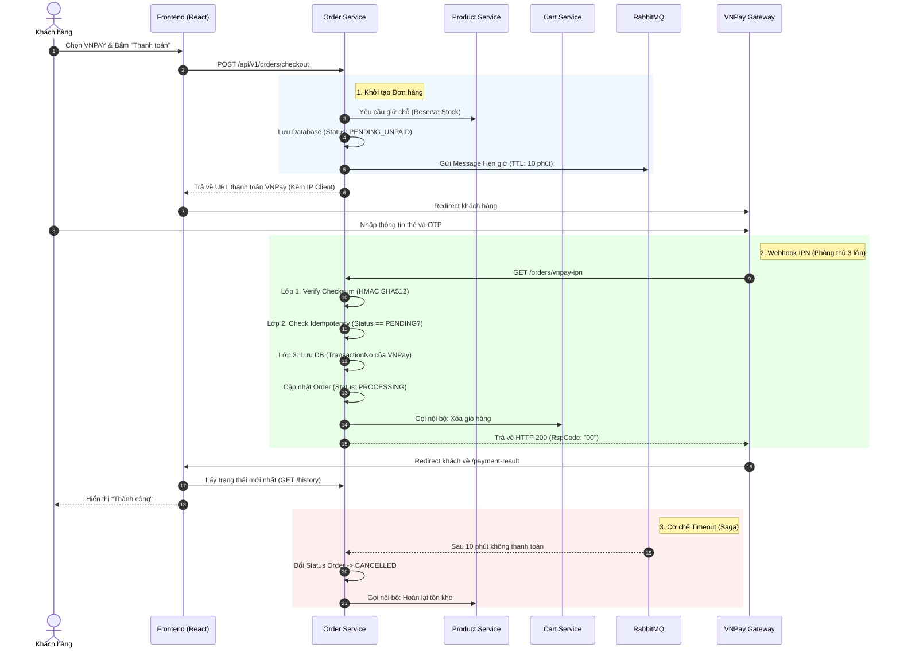

# Luồng Thanh Toán VNPay (Payment Flow)

Tài liệu này mô tả chi tiết quy trình xử lý thanh toán qua cổng VNPay trong hệ thống kiến trúc Microservices. Luồng giao dịch được thiết kế với **tiêu chuẩn bảo mật Production-ready**, đảm bảo an toàn dữ liệu, chống giả mạo chữ ký (Checksum), chống kẹt luồng (Idempotency) và xử lý tự động các đơn hàng quá hạn nhờ RabbitMQ.

---

## 1. Sơ đồ Tuần tự (Sequence Diagram)

### 2. Chi tiết 

#### Khởi tạo Đơn hàng (Initiate Order)
* **Endpoint:** `POST /api/v1/orders/checkout`
* **Xử lý nội bộ:** * Gọi sang `Product Service` để khóa số lượng sản phẩm (Reserve Stock).
  * Trạng thái đơn hàng: `PENDING_UNPAID`. Giỏ hàng (`Cart`) **chưa bị xóa**.
  * Extract IP thật của Client (bỏ qua proxy/gateway) để đính kèm vào payload gửi VNPay.
  * Bắn event vào **RabbitMQ** với thời gian sống (TTL) 10 phút.

#### Chuyển hướng và Thanh toán
* Backend trả về `paymentUrl`, Frontend Redirect người dùng sang cổng thanh toán VNPay.
* VNPay xử lý các vấn đề liên quan đến việc nhập thẻ và xác thực OTP.

#### Webhook IPN 
API public để VNPay gọi ngược lại báo kết quả (`GET /api/v1/orders/vnpay-ipn`).

1. **Lớp 1 - Bảo mật Checksum:** * Thu thập 100% tham số VNPay trả về bằng cấu trúc dữ liệu động (`Map<String, String>`).
   * Loại bỏ các trường chữ ký, sắp xếp Alphabet, nối chuỗi và băm bằng thuật toán `HMAC SHA512` cùng `Secret Key`.
   * So sánh kết quả với `vnp_SecureHash`. Lỗi sẽ bị hệ thống trả về với mã lỗi `97 - Invalid Checksum`.
2. **Lớp 2 - Tính lũy đẳng (Idempotency):**
   * Truy vấn trạng thái đơn hàng hiện tại. Nếu đơn hàng **không còn** ở trạng thái `PENDING_UNPAID` (nghĩa là đã xử lý thành công trước đó, hoặc đã bị hủy), hệ thống lập tức bỏ qua IPN này và trả về mã lỗi `02 - Order already confirmed`. Điều này chống lại hiện tượng VNPay spam gọi lại khi mạng lag, đảm bảo an toàn cho luồng trừ kho.
3. **Lớp 3 - Cập nhật Database:**
   * Sử dụng trực tiếp `vnp_TransactionNo` (Mã tham chiếu của ngân hàng) làm `TransactionCode` để lưu vào Database, phục vụ cho nghiệp vụ đối soát và hoàn tiền.
   * Đổi trạng thái bảng `orders` thành `PROCESSING`.
   * Gọi qua `Cart Service` để xóa sạch giỏ hàng của User.

#### Timeout bằng Message Broker
Trong trường hợp khách hàng tắt trình duyệt, hủy thanh toán hoặc thẻ không đủ tiền (Đơn hàng kẹt ở `PENDING_UNPAID`):

* Sau 10 phút, message trong RabbitMQ hết hạn và rớt vào **Dead Letter Exchange (DLX)**.
* Hệ thống bắt lại message này, tự động chuyển trạng thái đơn hàng thành `CANCELLED`.
* Kích hoạt luồng bù trừ (Compensation Transaction), gọi sang `Product Service` trả lại tồn kho (Increase Stock).